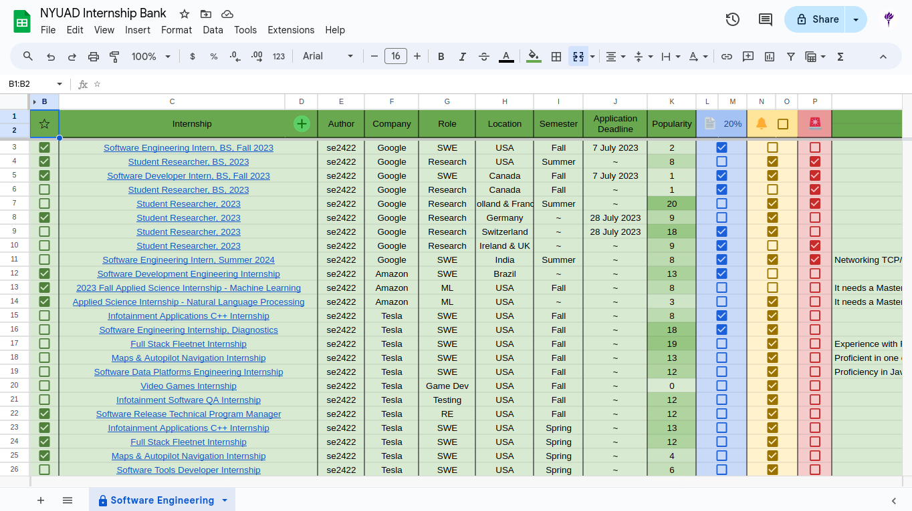

# NYUAD Internship Bank &nbsp;  

### Description

This is an internship applications sharing interface, that is intended to be used by NYUAD (New York University in Abu Dhabi) students to collaboratively share internship applications information, the list of which is managed and maintained by a centralised server.

### Background Story

My friends and I were collaboratively looking for internships and therefore I created a google sheet for my friend group to upload software engineering internships that we found, and then my friend Ahmed Elsaeed was the first to suggest that I share it with the entire NYUAD community. I thought it was a great idea but I was a bit concerned about the neatness and organisation of the sheet if everyone had write access and then in the upcoming 2-3 days I already had a structure in mind for this project, after discussin it with Youssab William, Omar Shehab and other friends.

Hopefully as you are reading this I would have already finished coding it and this project would already be deployed and adopted by NYUAD's community and hopefully other communities too :)
